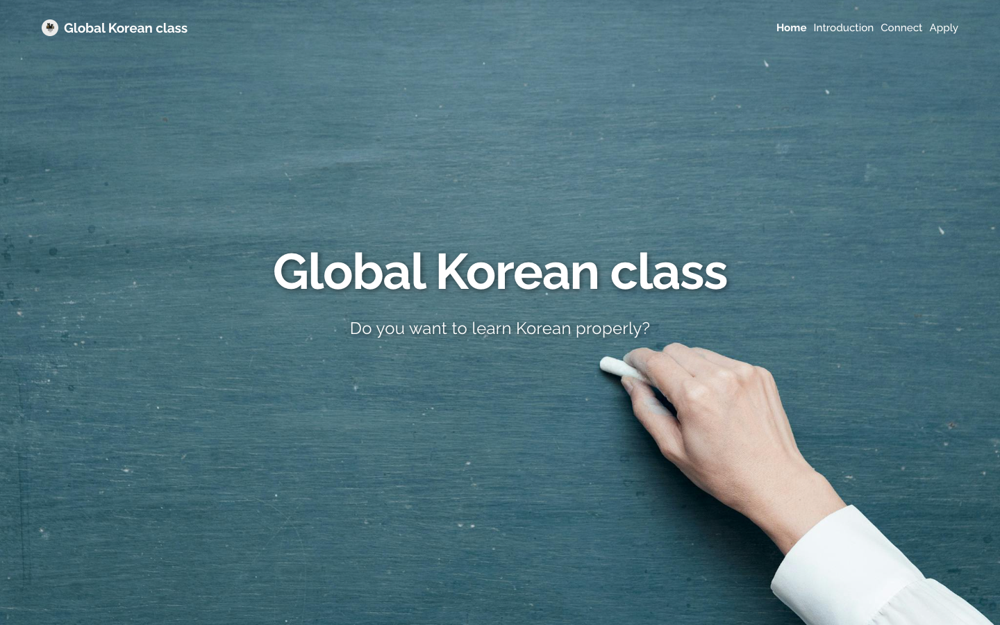
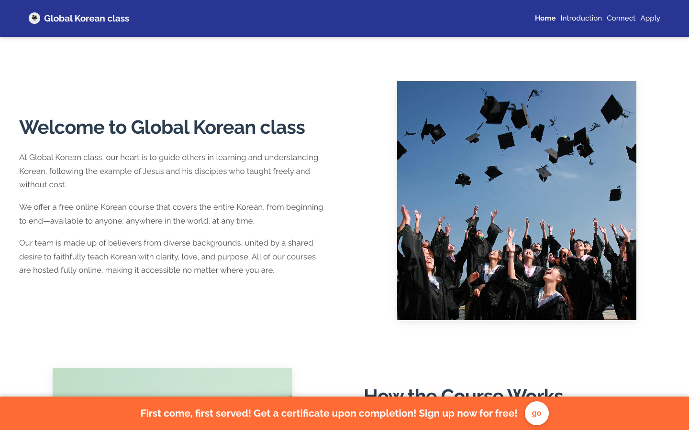
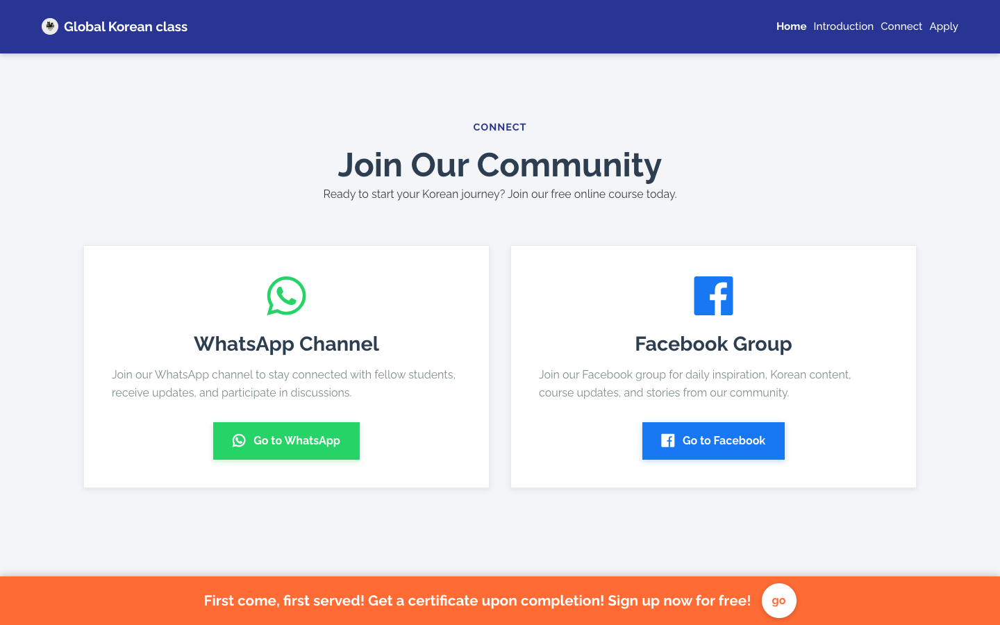
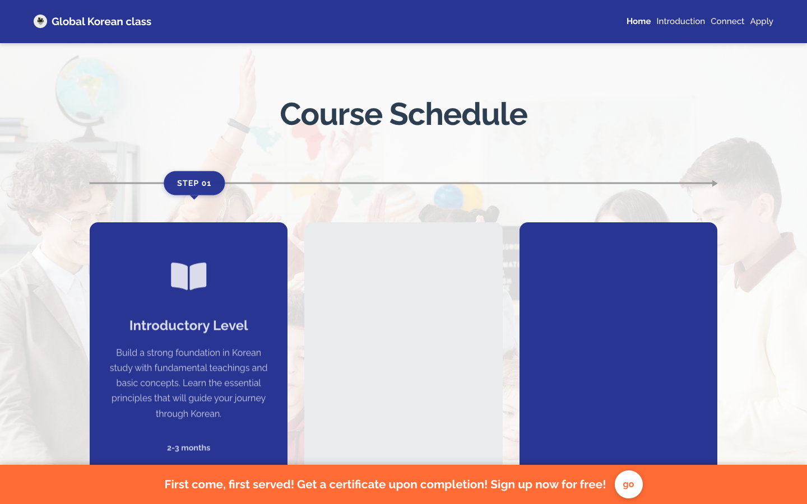
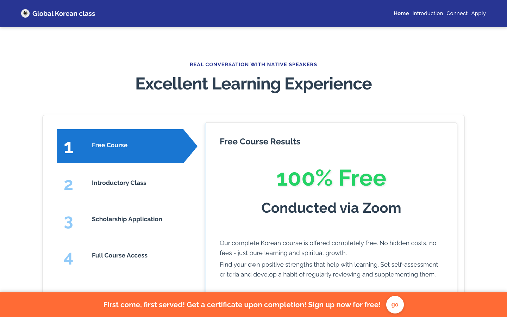
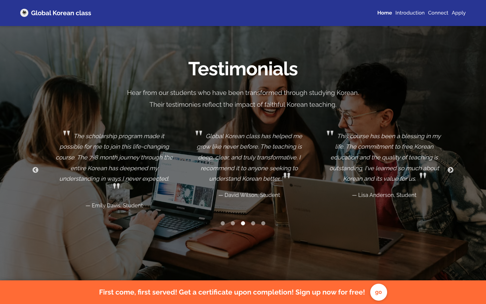
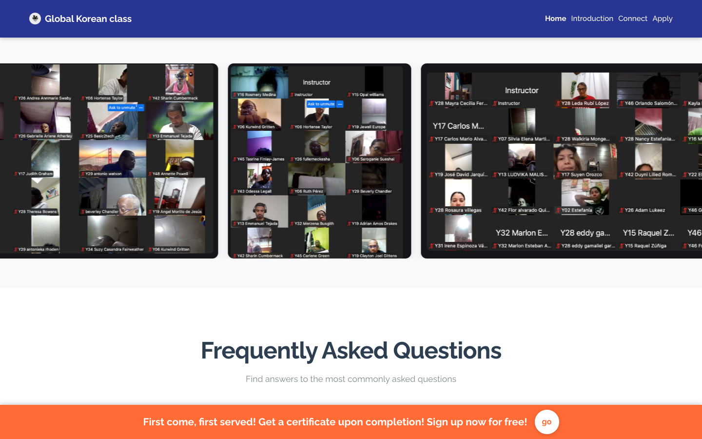
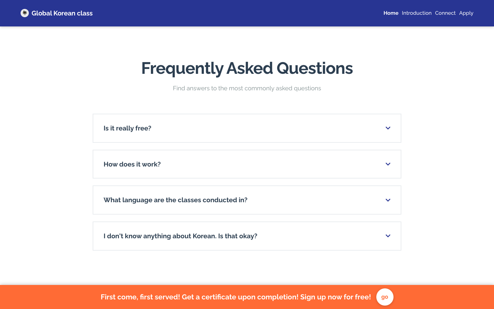
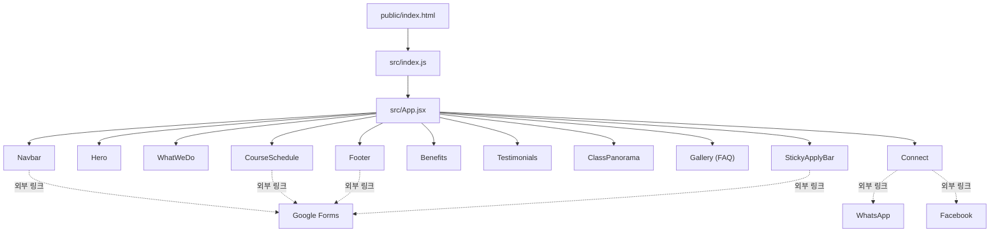

# Global Korean class

Global Korean class는 한국어를 배우고 싶은 모든 사람을 위한 무료 온라인 한국어 교육 프로그램을 소개하는 랜딩 페이지입니다. 원어민과의 실제 대화를 통해 한국어를 배울 수 있는 프로그램을 홍보하고, 신청 및 커뮤니티(WhatsApp, Facebook) 채널로 방문자를 안내합니다.

> 이 프로젝트는 **백엔드/DB/자체 API 서버가 없는 순수 프론트엔드 정적 SPA**입니다. 신청 접수와 커뮤니티 연결은 모두 외부 서비스(Google Forms, WhatsApp, Facebook)로의 링크 연동으로 처리됩니다.

## 스크린샷

| Hero | 프로그램 소개 (WhatWeDo) |
|---|---|
|  |  |

| 커뮤니티 연결 (Connect) | 코스 일정 (CourseSchedule) |
|---|---|
|  |  |

| 학습 혜택 (Benefits) | 후기 (Testimonials) |
|---|---|
|  |  |

| 클래스 파노라마 | FAQ (Gallery) |
|---|---|
|  |  |

## 주요 기능

원페이지 스크롤 구조로, `src/App.jsx`가 아래 11개 섹션 컴포넌트를 순서대로 렌더링합니다.

| 섹션 | 컴포넌트 | 앵커 ID | 설명 |
|---|---|---|---|
| Navbar | `Navbar.jsx` | - | 스크롤 시 배경 변경, 모바일 햄버거 메뉴, 부드러운 스크롤 이동 |
| Hero | `Hero.jsx` | `#infinite` | 이미지 3장 자동 슬라이드(5초 간격), 스크롤 패럴랙스 |
| WhatWeDo | `WhatWeDo.jsx` | `#whatwedo` | 프로그램 소개(Welcome / 코스 진행 방식 / 원어민 대화), 코스 일정 2가지 옵션 안내 |
| Connect | `Connect.jsx` | `#connect` | WhatsApp 채널, Facebook 그룹 링크 카드 |
| CourseSchedule | `CourseSchedule.jsx` | `#courseschedule` | 3단계 학습 과정(Introductory/Intermediate/Advanced), 스크롤 등장 애니메이션 |
| Benefits | `Benefits.jsx` | `#benefits` | 4단계 프로세스 탭 UI(15초 자동 전환), 단계별 상세 정보 |
| Testimonials | `Testimonials.jsx` | `#testimonials` | react-slick 캐러셀 후기 슬라이더(4초 자동재생), 배경 패럴랙스 |
| ClassPanorama | `ClassPanorama.jsx` | `#class-panorama` | requestAnimationFrame 기반 무한 루프 가로 스크롤 이미지 파노라마 |
| Gallery(FAQ) | `Gallery.jsx` | `#gallery` | 자주 묻는 질문 아코디언 |
| Footer | `Footer.jsx` | - | 연락처(Facebook/WhatsApp), 신청 버튼, 저작권 |
| StickyApplyBar | `StickyApplyBar.jsx` | - | 스크롤 300px 이상 시 하단 고정 신청 유도 바 |

- **신청(Apply) 버튼**은 Navbar, WhatWeDo, CourseSchedule, Footer, StickyApplyBar 등 여러 곳에서 동일한 Google Forms URL로 연결됩니다(하드코딩).
- `ApplicationForm.jsx` 컴포넌트는 저장소에 존재하지만 `App.jsx`에서 import되지 않아 **현재 화면에는 렌더링되지 않는 미사용 컴포넌트**이며, 내용상으로도 자체 폼이 아니라 Google Forms로 이동하는 버튼입니다.

## 기술 스택

| 구분 | 사용 기술 |
|---|---|
| 언어 | JavaScript (JSX), ES6+ |
| 프레임워크 | React 18.2.0 |
| 빌드 도구 | Create React App (react-scripts 5.0.1) |
| 라우팅 | 없음 — react-router 미사용, 앵커(`#id`) + `window.scrollTo` 스무스 스크롤 방식 |
| 캐러셀 | react-slick, slick-carousel |
| CSS 프레임워크 | Bootstrap 4.6.2 |
| 아이콘 | Font Awesome 5.5 |
| 상태 관리 | 전역 상태관리 라이브러리 없음 — 컴포넌트별 로컬 `useState`/`useEffect`만 사용 |
| 패키지 매니저 | npm |

## 전체 아키텍처

### 디렉토리 구조

```
01_2_Korean_Web/
├── public/
│   ├── index.html          # CRA 템플릿, Bootstrap/Font Awesome CSS 링크
│   ├── img/                 # 정적 이미지
│   ├── css/bootstrap.min.css
│   └── fontawesome-5.5/
├── src/
│   ├── App.jsx               # 11개 섹션 컴포넌트를 평면적으로 조합 (라우팅 없음)
│   ├── index.js               # ReactDOM 진입점
│   └── components/            # 섹션별 .jsx + 동일 이름 .css 페어링
├── package.json
├── vercel.json                # Vercel 배포 설정
└── .vercelignore
```

### 컴포넌트 계층 및 렌더링 흐름

`App.jsx`가 모든 섹션 컴포넌트를 1단계로 나열하는 평면 구조이며, 컴포넌트 간 props 전달이나 합성 없이 각 섹션이 독립적으로 자기 완결적(self-contained)입니다. 스타일은 CSS Module이 아닌 컴포넌트별 일반 global CSS를 각 `.jsx`에서 직접 import합니다.



### 라우팅 방식

React Router 없이, `id` 속성이 있는 `<section>`(`#infinite`, `#whatwedo`, `#connect` 등)을 앵커로 사용합니다. `Navbar`, `CourseSchedule`, `WhatWeDo` 등 여러 컴포넌트에 동일한 패턴(offset 80px, `window.scrollTo({ behavior: 'smooth' })`)의 `scrollToSection` 함수가 각자 중복 구현되어 있습니다.

### 빌드/배포

- **Vercel 정적 호스팅**을 사용합니다. `vercel.json`에서 `@vercel/static-build`로 `build` 디렉토리를 빌드 산출물로 지정하고, 정적 자산에 1년 캐시 헤더를 설정, 나머지 모든 경로는 `/index.html`로 rewrite(SPA 폴백)합니다.
- Docker, CI(GitHub Actions) 등의 설정 파일은 저장소에 없습니다.

## API

- **자체 백엔드/API 서버가 없습니다.** 저장소 전체에 Express/Node 서버나 API 라우트 코드가 존재하지 않으며, `fetch`/`axios`를 통한 API 호출 코드도 없습니다.
- 외부 서비스 연동은 모두 **단순 하이퍼링크** 방식입니다.

| 서비스 | 용도 | 연동 위치 |
|---|---|---|
| Google Forms | 프로그램 신청 접수 | `Navbar.jsx`, `WhatWeDo.jsx`, `CourseSchedule.jsx`, `Footer.jsx`, `StickyApplyBar.jsx`, `ApplicationForm.jsx`(미사용)에 동일 URL 하드코딩 |
| WhatsApp | 커뮤니티 채널 링크 | `Connect.jsx` |
| Facebook | 커뮤니티 그룹 링크 | `Connect.jsx`, `Footer.jsx` |
| Unsplash | 후기 섹션 배경 이미지(원격 URL) | `Testimonials.jsx` |

- 인증(로그인/회원가입) 기능은 없습니다.

## 데이터 연동

- **데이터베이스 없음** — DB 클라이언트, ORM, 스키마 파일이 전혀 없습니다.
- **환경변수(.env) 없음** — `.vercelignore`에 `.env.local` 등이 무시 목록으로 등록되어 있지만, 실제 `.env*` 파일은 저장소에 존재하지 않고 사용자 정의 `process.env.*` 참조도 없습니다.
- **콘텐츠는 전부 하드코딩** — 후기 문구, FAQ, 코스 설명 등 모든 텍스트 콘텐츠는 각 컴포넌트 파일 내 JS 배열/객체로 직접 작성되어 있습니다(예: `Testimonials.jsx`의 `testimonials` 배열, `Gallery.jsx`의 `faqs` 배열, `Benefits.jsx`의 `scholarshipInfo` 배열). CMS 연동은 없습니다.
- **렌더링 방식** — CRA 기본 CSR(Client-Side Rendering). SSR/SSG 관련 설정은 없습니다.
- **외부 리소스** — 후기 섹션 배경 이미지 1건만 Unsplash에서 원격 로드하고, 나머지 이미지는 전부 `public/img/`의 로컬 정적 파일입니다.

## 시작하기

### Prerequisites

- Node.js (v14 이상)
- npm

### Installation

```bash
git clone <repository-url>
cd 01_2_Korean_Web
npm install
```

### 개발 서버 실행

```bash
npm start
```

개발 서버는 [http://localhost:3000](http://localhost:3000)에서 실행됩니다.

### 프로덕션 빌드

```bash
npm run build
```

빌드된 파일은 `build` 폴더에 생성됩니다.

## 배포

이 프로젝트는 Vercel을 통해 배포됩니다.

1. GitHub에 코드 푸시
2. [Vercel](https://vercel.com)에서 저장소 연결 → 자동 배포

또는 Vercel CLI 사용:

```bash
npm i -g vercel
vercel --prod
```

## 브라우저 지원

- Chrome, Firefox, Safari, Edge (최신 버전)

## 라이선스

©Copyright Global Korean class. All Rights Reserved.
